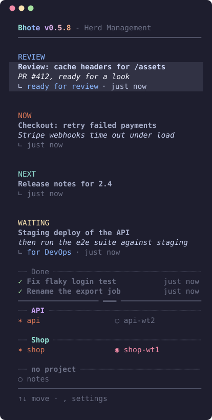

# bhote

[](https://github.com/floriankappert/bhote/actions/workflows/tests.yml)
[](https://github.com/floriankappert/bhote/releases)
[](LICENSE)

*by Florian Kappert and Jakob Beyer*

A side panel for [herdr](https://herdr.dev) that keeps your **topics** (what you work on, who you wait for) next to your
**agents** (who is free, who is busy), on every machine you work on. herdr is a terminal multiplexer for coding agents
such as Claude Code and Codex; bhote sits in a narrow pane next to them. It is a single bash script, about 44 columns
wide, with a small sheepdog that guards the herd.

<p align="center"></p>

## Features

- **Topics** move through `now`, `next`, `waiting` (for a name, with a date), `review`, `later` and `done`, each with an optional description.
  The panel shows what is on (review, now, next, waiting); the last done topics sit in their own area, with the agent that did them.
- **Agents of all machines** in one list, grouped by project: working ones in Claude orange, ones that need you in red, idle ones grey,
  with the topic each works on. Every agent has a fixed number on its machine (`MAC4`, `OMR1`), also a ref for the CLI.
- **Start a topic on a free agent** (`s`): bhote sends title and description to its pane. With `AUTO_ASSIGN` a `now` topic is started by itself on the next free agent of its project.
- **Review topics by themselves:** an agent that asks you a question or waits for an answer gets a review topic (`Question from <agent>`); it goes when the agent works again (`AUTO_REVIEW`).
- **Waiting:** agents that have to wait for someone create a waiting topic themselves (bhote skill for Claude Code); when you mark the wait as over, the agent goes on. A waiting topic can carry a **Slack pin** (channel, DM or thread); when someone writes there, it goes to review. Claude Code and its Slack connector do the reading, so bhote needs no Slack token.
- **Steal & Transfer:** an agent commits its state with a handover on its branch, and a free agent takes over ([how](docs/steal-and-transfer.md)).
- **Projects:** an agent belongs to a project by its git repository (worktrees inherit); the panel can list only its project's topics. **GitHub:** the branch a topic's agent works on.
- **Deployment and test monitor:** the last deployments (GitHub Actions, CircleCI with its approvals) and test runs (CI test jobs, local runs through `bhote test run`, live status files) of your projects, seven each, with progress bars, above the agents.
- **Search from anywhere in herdr** (the find key, e.g. `ctrl+alt+t`): all agents and topics, `⏎` jumps there, `ctrl+n` adds a topic.
- **Topics are plain files**, kept in sync with a second machine through herdr's own connection (opt-in); **update notice** when a newer version is out.
- **Omarchy bar widget**, themes (terminal colours or Catppuccin, each role overridable), a **setup wizard** and the Claude skill `/bhote-install`.
- A **CLI** (every command with `--json`) to create and close topics from scripts and agents.

## Requirements

- macOS or Linux, bash 3.2 or newer (the bash that ships with macOS is enough)
- [herdr](https://herdr.dev) and `jq`
- optional: Claude Code (skills, the SessionStart hook, the Slack watch), `gh` or a CircleCI token (the monitors), Omarchy (the bar widget)

## Install

**Recommended: install it, then let Claude Code finish the setup.** Two commands, then one word in a Claude Code session:

```sh
brew install floriankappert/bhote/bhote      # Arch/Omarchy and other Linux: see below
bhote skills install                         # the Claude Code skills bhote and bhote-install, in every Claude profile
```

In Claude Code: **`/bhote-install`**. The skill installs the herdr plugin, the Omarchy bar widget, the Claude hook and skills,
the settings, the connection to your other machines and the deployment and test monitor, and checks each step. (The
interactive wizard `bhote setup` does the same by hand.)

**macOS** (Homebrew):

```sh
brew install floriankappert/bhote/bhote
herdr plugin link "$(brew --prefix)/share/bhote/herdr-plugin"
```

**Arch Linux / Omarchy** (the package from `packaging/arch`; it also brings the Omarchy bar widget):

```sh
git clone https://github.com/floriankappert/bhote && cd bhote/packaging/arch && makepkg -si
herdr plugin link /usr/share/bhote/herdr-plugin
# Omarchy: the bar widget
ln -s /usr/share/bhote/omarchy-plugin ~/.config/omarchy/plugins/bhote.bar && omarchy plugin enable bhote.bar --section right
```

**Any Linux** (also Homebrew on Linux works with the command above), or from a checkout on any system:

```sh
git clone https://github.com/floriankappert/bhote && cd bhote && ./install.sh
```

`install.sh` links `~/.local/bin/bhote` to the checkout (update with `git pull`) and, when herdr is present, the plugin
`bhote.panel`, which opens the panel on the right of the agent pane of every tab when herdr starts (`AUTOSTART=off` in the
config switches that off; the action "Bhote: open panel" opens it by hand). On Omarchy it also links the bar widget
`bhote.bar`: the number of things for you (topics in review, agents that need an answer), the list on hover, a click jumps
to the bhote panel in herdr (right click: the search). `bhote bar` prints the same as Waybar-style JSON for any other bar.

After an update, `bhote reload` restarts the panels of the machine (never type into a running panel: keys act as hotkeys there).

## Quick start

Start herdr; the panel opens next to the agent pane of each tab (or run `bhote` in any pane). The first start shows the
setup wizard. Then:

- `n` adds a topic (`Fix the login redirect; users land on /home`), `↑↓` choose one, `s` starts it on a free agent.
- `x` checks it off, `→` opens its page with every action, `,` opens the settings.
- From a script or an agent:

  ```sh
  id=$(bhote add "Migrate the billing export" -d "CSV to Parquet" --json | jq -r .id)   # keep the id, not the number
  bhote wait "$id" DevOps && bhote now "$id" && bhote done "$id"
  ```

## Keys

| key | does |
|---|---|
| `↑↓` / `jk` | move |
| `⏎` | jump to the topic's agent in herdr (in another tab the focus goes to the bhote panel there; no agent: the topic's page) |
| `→`, `←` / `esc` | the topic's page / go back |
| `n` | new topic: `Title`, `Title; description`, optionally ending in `@Name` or `> Name` (= waiting for Name) |
| `s` | start the topic on a free agent |
| `t` | Steal & Transfer to another agent |
| `e` / `d` | edit the title / the description (Esc cancels) |
| `x` | mark done |
| `a` | topics suggested from what the running agents work on |
| `,` | settings · `S` welcome screen · `w` the new wizard steps · `q` quit |
| click a topic | select it (any of its lines; the list does not scroll while it is in view); a double click opens its page, where a click runs an action or edits the title or description |
| click an agent | focus it in herdr (on another machine: selected there; the panel says which keys switch to it) |
| find key (e.g. `ctrl+alt+t`, ⌘T) | search all agents and topics, jump there (`bhote find` as a herdr popup) |
| herdr prefix, `t` | jump from the agent to the panel and back (the plugin action `bhote.panel.focus`; the keys are shown bottom right) |

The full list is in [the panel](docs/panel.md).

## CLI and configuration

The CLI is the API: the panel, scripts and agents all work on the same topics through it. Every command takes `--json`
(one document per call), results go to stdout, messages to stderr. Exit codes: `0` ok · `1` error · `2` the ref matches
more than one topic. `bhote help` lists every command; the **[CLI reference](docs/cli-reference.md)** has the detail.

Settings live in `~/.config/bhote/config` (`KEY=value` lines, never sourced, so a value cannot run as code). Edit them in
the panel (`,`) or with `bhote config set KEY value`; `bhote config list` shows all. Nothing that reaches another machine
is on by default. Every key is in the **[configuration reference](docs/configuration.md)**.

## Data and safety

Topics live in `${XDG_DATA_HOME:-~/.local/share}/bhote/topics` (one small file per topic). With a replica machine, the
local copy stays the working copy; the newer `updated` wins per topic, deletions travel as tombstones, and while the
machine is not reachable bhote works offline and merges later ([data and sync](docs/data-and-sync.md)).

bhote opens no connection to another machine unless you switch it on. Names that arrive from a replica are validated before
they become files; control characters are stripped from everything shown or sent; scratch and shared folders are private
(0700); one panel per machine collects agent data, the others read its result. To report a vulnerability, see
[SECURITY.md](SECURITY.md).

## Troubleshooting

- **Something is missing:** `bhote setup --json` lists what is installed and what is not (herdr plugin, Claude hook,
  machines); `/bhote-install` in Claude Code repairs it.
- **No panel opens:** `herdr plugin list` must show `bhote.panel`; `AUTOSTART=off` keeps it closed; a tab narrower than
  the panel plus 64 columns for the agent gets none (open it by hand with the action "Bhote: open panel").
- **No agents are listed:** `bhote agents` shows what herdr reports; agents of other machines need `REMOTE_AGENTS=on`
  and a saved herdr machine.
- **The panel shows an old version after an update:** `bhote reload`.
- **`bhote: ... jq`:** install `jq` (`brew install jq`, `pacman -S jq`, `apt install jq`).

## Uninstall

```sh
herdr plugin unlink bhote.panel                       # every install
brew uninstall bhote                                  # Homebrew
sudo pacman -R bhote                                  # Arch
rm ~/.local/bin/bhote                                 # install.sh
rm ~/.config/omarchy/plugins/bhote.bar                # Omarchy bar widget (install.sh)
```

Your topics and settings stay until you remove them: `~/.config/bhote` and `${XDG_DATA_HOME:-~/.local/share}/bhote`.
Claude Code: delete `skills/bhote` and `skills/bhote-install` in each Claude profile (`~/.claude`, …) and the
`bhote current` entry under `hooks.SessionStart` in its `settings.json`.

## Contributing

Bug reports, ideas and pull requests are welcome; see [CONTRIBUTING.md](CONTRIBUTING.md) for the development setup, the
tests and the few rules the script lives by (bash 3.2, nothing leaves the machine by default). Please follow the
[code of conduct](CODE_OF_CONDUCT.md). Questions: [SUPPORT.md](SUPPORT.md).

## License

MIT, see [LICENSE](LICENSE). Documentation: [docs/](docs/README.md), starting with the [CLI reference](docs/cli-reference.md).
